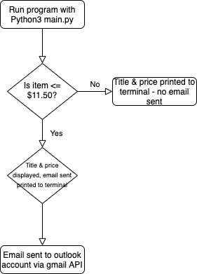
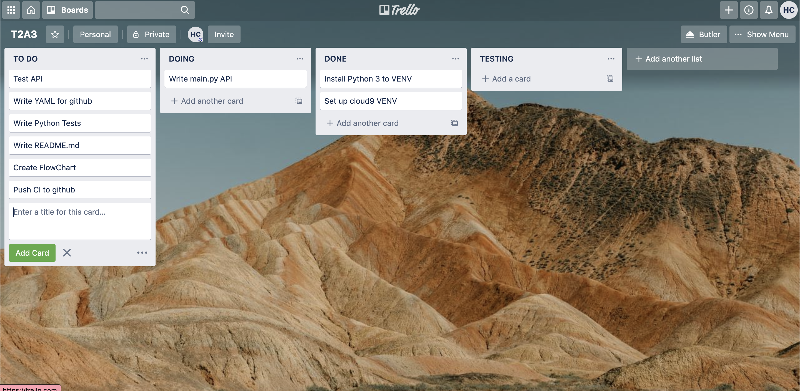

# HOLLYCOOPER_T2A3 - ETSY  WEB SCRAPER
=======================================

## This is terminal application is an Etsy web scraper.
The problem I am solving with my terminal application is when to buy a product online.
Products online increase and decrease all the time, so you never know when you are
*actually* getting the best price, or when the item will actually be in your 
budget to purchase. This terminal application uses Web Scraping with Etsy to 
track the price desired item, and alert the user via email when the item is at
or below their desired price.
The item I have decided to track is a pair of Dr Phil earrings sold on Etsy.
When the earrings fall below a price of $11.50 AUD, the application will send
me an email to my outlook account, sent from my gmail. The application will 
check the price once each day. This can be changed to be more frequent or less 
frequent, by modifying the timer. If the item is below $11.50 AUD, an email 
will be sent and the terminal will display a message to let the user know that
the email has been sent successfully. If the item is *not* under the $11.50, a 
message will be printed to the terminal to let the user know that no email has been 
sent, as the price has not fallen.

Look how easy this terminal application is to use:

Run python3 main.py in the terminal
The terminal will connect to Etsy using the API
If the item is below $11.50 AUD an email will be sent, and the user will be
notified that the user has been sent an email, that includes the link to the 
amazon product. 

## Features
------------------------------------------------------------
- Solves the problem of not knowing when to buy an item - avoid overpaying.
- A user can purchase the item that they desire within their budget/price that 
- they are willing to pay.
- A much more convenient way than checking the item you want to buy each day - let this terminal application do the hard work for you, and simply email you when the item is at or below your desired price.

## Installation
------------------------------------------------------------

Install HOLLYCOOPER_T2A3 by opening this file and running the following in
the terminal:
python3 main.py 

--------------------------------------------------------------
## Flow Chart

--------------------------------------------------------------

## Trello Board Screen Shots

